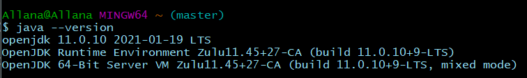
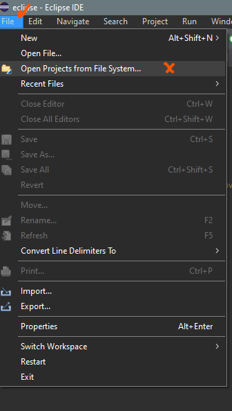
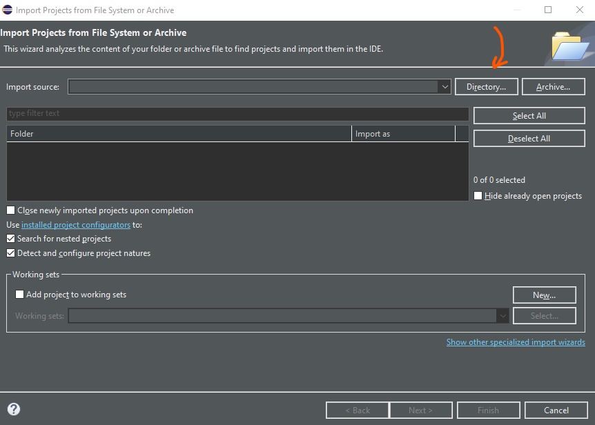
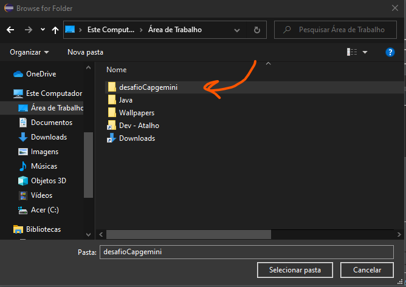
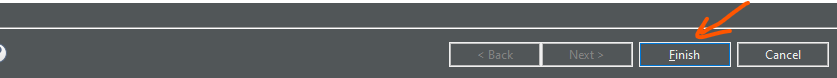
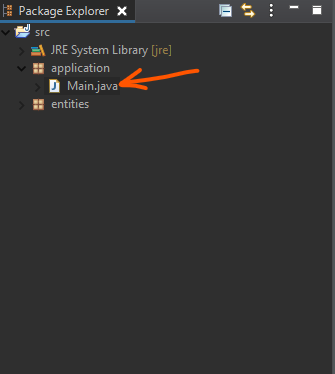
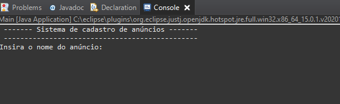

# Desafio Capgemini - Allana Caldas
 
 
## Instalando o Java na sua máquina
Caso você já tenha o java instalado na sua máquina, pode seguir para o próximo tópico. Para fazer a instalação da JVM - máquina virtual responsável pela execução do código depois de compilado, você vai precisar recorrer ao site da Oracle para baixar o JDK (Java Development Kit). Nesse desafio, foi usado a versão 11 - LTS:

**Java SE 11 (LTS)**
https://www.oracle.com/br/java/technologies/javase-jdk11-downloads.html

Assim que o download estiver concluído, você deve proceder com a configuração dele na sua máquina seguindo esse tutorial abaixo:

**Tutorial de configuração**
https://www.youtube.com/watch?v=-LdVKkKLGkw

Após feito todo o procedimento, você deve verificar se de fato o Java foi mesmo instalado com sucesso, abra o terminal da sua preferência (pode ser o gitbash, o shell ou até o cmd mesmo)  e digite ***java --version***

## Instalando o eclipse
O **Eclipse** é uma IDE já muito conhecida no mundo Java e, para exemplificar, ela será usada nesse desafio. Você pode seguir a instalação e a configuração da IDE pelo tutorial abaixo:

https://www.youtube.com/watch?v=hY7y3oJ41eE

## Abrindo o projeto no Eclipse
Agora que você já instalou o Java e o Eclipse na sua máquina, já pode abrir o projeto e finalmente cadastrar os anúncios. Assim que o programa abrir, você clica em ***File***, em seguida  ***Open Projects from File System*** conforme imagem abaixo

Abrirá uma outra janela, estando nela clicamos em ***Directory***

No meu caso, a pasta ***desafioDaCapgemini*** estava no Desktop. Selecionei-a e cliquei em ***Selecionar pasta***

Clicando em ***Finish*** , sua pasta finalmente estará aberta no Eclipse

Na aba ***Package Explorer***, você verá a pasta ***src*** e, dentro dela, o pacote ***application***. Lá dentro tem o nosso ***Main***, selecione-o e aperte as teclas ***ctrl + F11***

Através do comando acima, o programa entrará em execução e você poderá preencher todas as informações do anúncio através da aba ***console*** 

### Contato
**LinkedIn**: https://www.linkedin.com/in/allanacaldas/
**Email**: allanacaldas@gmail.com

